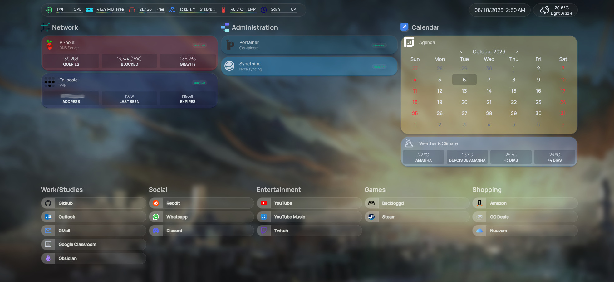
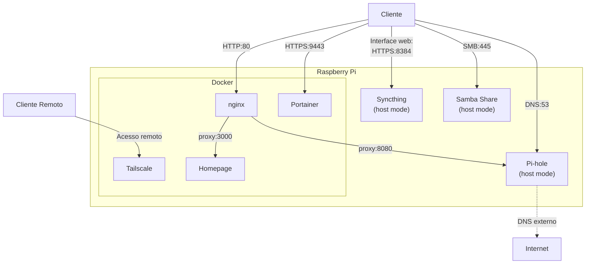
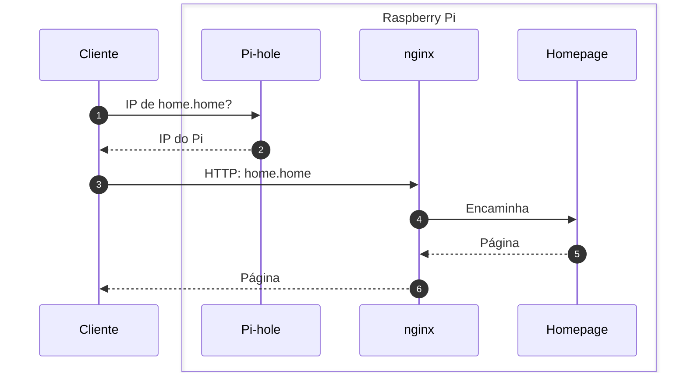

# Light Homelab Pi 3B+
Repositório de Homelab leve para Raspberry Pi 3B+ montado com Docker, utilizando serviços essenciais como Pi-hole, Tailscale, Portainer, Syncthing, Homepage, nginx e Samba.




> [!IMPORTANT]
> Isso é um projeto pessoal, e não um template; será necessário fazer ajustes para funcionar corretamente.

## Índice
- [Contexto](#Contexto)
- [Segurança](#Segurança)
- [Arquitetura](#Arquitetura)
- [Serviços](#Serviços)
- [Decisões Técnicas](#Decisões-Técnicas)
- [Problemas Resolvidos](#Problemas-Resolvidos)
- [Estrutura e Instalação](#Estrutura-e-Instalação)
- [Limitações e próximos passos](#Limitações-e-próximos-passos)
- [Fontes](#Fontes)
- [Licença](#Licença)

## Contexto
O objetivo é ter, em um único Raspberry Pi 3B+, nomes locais (`home.home`, `pihole.home`), DNS com bloqueio de anúncios, um painel único, sincronização de notas, uma pasta compartilhada e acesso remoto sem abrir portas no roteador.

As restrições guiaram as escolhas: 1 GB de RAM (cerca de 450 MiB disponíveis com tudo funcionando), 32 GB em cartão microSD e nenhum disco externo. Por isso ficaram de fora serviços pesados, como pilhas de mídia, Nextcloud e stacks de monitoramento.

Para esse Homelab, foi utilizado:

- Raspberry Pi 3B+
- Cartão MicroSD de 32 GB
- Debian Linux 13

## Segurança

**Premissas:** O roteador não tem redirecionamento de portas (e o UPnP está desativado), e o Pi não tem IPv6 global. O acesso de fora de casa passa somente pelo Tailscale.

**Segredos:** Senhas, chaves de API e URLs privadas ficam em `.env`, ignorados pelo Git, com um `.env.example` de modelo. No Homepage, os YAMLs usam placeholders `{{HOMEPAGE_VAR_...}}`. O repositório foi verificado com o [gitleaks](https://github.com/gitleaks/gitleaks) antes da publicação.

**Riscos aceitos:**

- O nginx serve HTTP na rede local: sem domínio próprio não há certificado válido, e o acesso remoto passa pelo Tailscale, que é criptografado. O Portainer, que tem login e HTTPS próprio, é acessado direto na porta 9443, sem passar pelo nginx.
- As portas diretas (`IP:3000`, `IP:8080`, `IP:9443`) continuam abertas na rede local: o nginx dá nomes, mas não protege.
- Homepage e Portainer montam o `docker.sock`: comprometer um deles significa controlar o Docker e, na prática, o Pi.
- O Tailscale anuncia a rede `192.168.1.0/24` e se oferece como exit node (a aprovação é feita no painel do Tailscale).
- Pi-hole, Syncthing e Samba rodam em modo host. O Pi-hole usa `listeningMode: LOCAL`, o Samba é restrito à rede local (`bind interfaces only`), e a interface do Syncthing exige usuário, senha e HTTPS.

## Arquitetura
O Homelab foi estruturado utilizando containers Docker, facilitando o gerenciamento e a reprodução dos serviços.



### Fluxo de requisição



## Serviços

| Serviço  | Portas | Descrição | Rede | Acesso |
| ------------- | ------------- | ------------- | ------------- | ------------- |
| Pi-hole  | 53, 8080, 8443  | Bloqueador de anúncios e DNS local | host | `pihole.home` em nginx |
| nginx  | 80  | Reverse proxy | bridge | N/A |
| Homepage | 3000 | Dashboard de acesso e monitoramento | bridge | `home.home` |
| Portainer | 9443 | Gestão do Docker | bridge | direto |
| Tailscale | N/A | VPN para acesso remoto | bridge | cliente Tailscale |
| Syncthing | 8384 | Sincronização contínua de arquivos | host | direto |
| Samba | 137, 138, 139, 445 | Compartilhamento SMB | host | rede local |

## Decisões Técnicas

**nginx como reverse proxy:** Os nomes locais apontam para o mesmo IP, e o nginx escolhe o destino pelo cabeçalho `Host`, com um `server` por serviço. O Caddy foi considerado, mas o nginx é mais usado e valia o aprendizado. O acesso pelo IP é recusado (`return 444`).

**Pi-hole em modo host:** Em bridge, o `listeningMode: LOCAL` só considera local a rede interna do Docker e descartava as consultas da rede local. As alternativas foram "permit all origins" em bridge e macvlan. O custo do modo host é a falta de isolamento de rede, e o painel usa as portas 8080 e 8443 para não competir com o nginx na porta 80.

**Syncthing e Samba em modo host:** Os dois dependem de descoberta na rede local, que usa broadcast e multicast e não atravessa a rede bridge do Docker.

## Problemas Resolvidos

| Sintoma | Causa | Solução |
| --- | --- | --- |
| nginx no ar, mas `curl localhost` retorna `Connection reset by peer` | O volume `./conf.d`, vazio, substituiu `/etc/nginx/conf.d` e apagou o `default.conf` da imagem: nenhum `server` | Manter os blocos `server` na pasta montada |
| Homepage por `home.home` responde `400` | `Host validation failed` no log | Incluir o nome em `HOMEPAGE_ALLOWED_HOSTS`, no compose do Homepage |
| DNS do Pi-hole dá timeout, com o container `healthy` | Em bridge, `LOCAL` descartava as consultas da rede local (`non-local network` no log, e o `tcpdump` mostrou os pacotes entrando sem resposta) | Modo host |
| `home.home` não resolve, mas o DNS responde | A lista de registros locais estava vazia (`dns.hosts` retornava `[]`) | Criar os registros com `pihole-FTL --config dns.hosts` |
| Widget com "API key is invalid" | O container não foi recriado depois de criar o `.env`, e o placeholder seguiu literal | `docker compose up -d --force-recreate`, conferindo com `printenv` |
| HTTPS ativado na interface do Syncthing, mas o HTTP continuava respondendo | O `STGUIADDRESS`, definido na inicialização, sobrepõe a configuração da interface | `STGUIADDRESS=https://0.0.0.0:8384` no compose |

O aprendizado principal: `healthy` indica que o processo do container responde, não que os clientes alcançam o serviço.

## Estrutura e instalação

Uma pasta por serviço, cada uma com o seu `docker-compose.yml`:

```text
docs/        capturas de tela
homepage/    dashboard (config/ com os YAMLs e o custom.css)
nginx/       reverse proxy (conf.d/ com um arquivo por serviço)
pihole/  portainer/  samba/  syncthing/  tailscale/
```
Não são versionados: os arquivos `.env`, os dados do Pi-hole, do Tailscale e do Syncthing, os logs e as imagens do Homepage (papel de parede e favicon).

Resumo para subir o ambiente:

1. Copiar o `.env.example` para `.env` em `homepage/`, `pihole/` e `samba/` e preencher os valores.
2. Substituir `seu-IP` pelo IP do Pi nos composes e YAMLs e ajustar a rede.
3. Rodar `docker compose up -d` em cada pasta.
4. Criar os registros DNS locais:

```bash
sudo docker exec pihole pihole-FTL --config dns.hosts '["IP_DO_PI home.home", "IP_DO_PI pihole.home"]'
```

## Limitações e próximos passos

- O Pi 3B+ não comporta uma nuvem privada (Nextcloud, Immich) nem uma pilha de mídia.
- Sem disco externo, não há backup automatizado, e uma cópia no mesmo cartão não protege contra a falha dele. Próximo passo: SSD ou HD externo com `restic` ou `rsync`.
- O DNS está em ponto único: se o Pi cair, a rede perde o DNS, a menos que o roteador tenha um DNS secundário.
- As imagens usam a tag `latest`, e a configuração foi testada em outubro de 2026.
- Ideias: Unbound (DNS recursivo), Uptime Kuma (testa o serviço do ponto de vista do cliente) e Ansible (automação da instalação).

## Fontes

- `homepage/config/custom.css`: baseado em um [post do r/selfhosted](https://www.reddit.com/r/selfhosted/comments/1renwpw/homepage_with_custom_css/) do usuário u/chronnz e adaptado para este projeto. O arquivo mantém a autoria original e não é coberto pela licença MIT deste repositório.
- Serviços: [Pi-hole](https://pi-hole.net), [nginx](https://nginx.org), [Tailscale](https://tailscale.com), [Syncthing](https://syncthing.net), [Portainer](https://www.portainer.io), [Homepage](https://gethomepage.dev) e a imagem de Samba do [ServerContainers](https://github.com/ServerContainers/samba).
- Ícones do dashboard: [Selfh.st Icons](https://selfh.st/icons/), [Simple Icons](https://simpleicons.org) e [Material Design Icons](https://pictogrammers.com/library/mdi/).
- Badges: [Shields.io](https://shields.io). 
- Estrutura do README baseada no [standard-readme](https://github.com/RichardLitt/standard-readme) e adaptada.

## Licença

[MIT](LICENSE) © 2026 Thiago Weber, exceto o `custom.css` (veja [Fontes](#Fontes)).